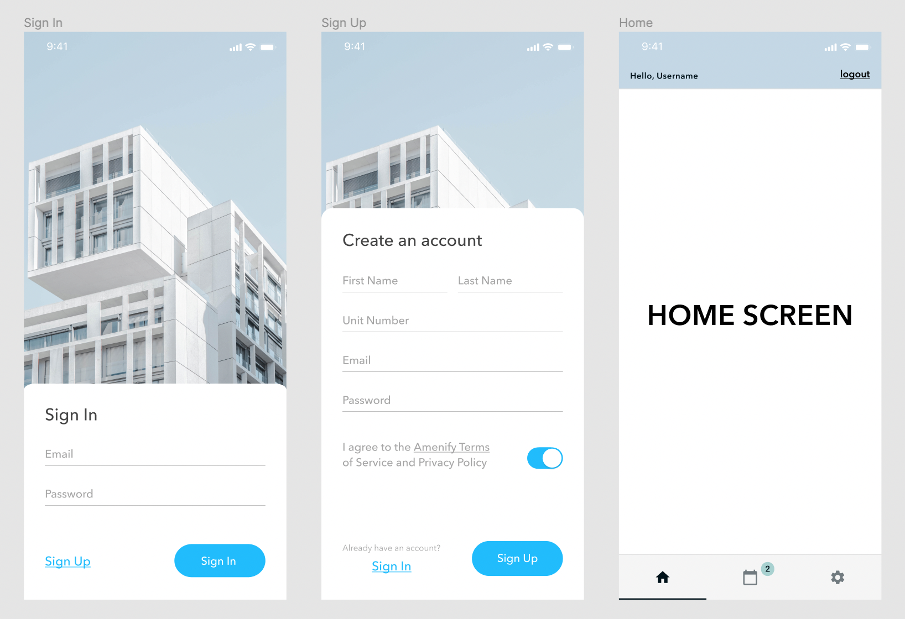

# Task: 
Implement simple authorization flow based on Figma design and GraphQL queries.



# What should you do:
  - Implement 3 screens(*Sign In, Sign Up, Home*)
  - Text inputs should have a simple validation and email, password, firstName, lastName, switcher are required fields
  - On the Home screen we should see username(firstName + lastName) from `myUser` query
  - Also on the Home screen user should be able logout
  - Please use `BottomTabNavigator` from `@react-navigation/bottom-tabs` to implement bottom bar

# What you may need:
  - Expo (http://expo.dev)
  - Apollo Client (http://apollo.io)
  - React Navigation (https://reactnavigation.org)
  - Any other packages you find useful
  - GraphQL endpoint (https://api.amenify.support/graphql)
  - [Figma Preview](https://www.figma.com/proto/kxIfivfsTHcDqOyMb8bTZJ/Amenify---Auth-Flow?page-id=0%3A1&node-id=11%3A2&viewport=554%2C449%2C0.63&scaling=min-zoom&starting-point-node-id=11%3A2)
  - [Figma Files](https://www.figma.com/file/kxIfivfsTHcDqOyMb8bTZJ/Amenify-Auth-Flow)

# Getting Started
  - Create a repo
  - Commit your changes
  - Send a link to the repository via email

## Sign In

```
mutation CreateToken($email: String, $password: String) {
  createTokenByPassword(email: $email, password: $password) {
    token {
      accessToken
      expiresIn
      refreshToken
    }
  }
}
```

*You should get token.accessToken field which you have to use for `MyUser` query*

## Sign Up
```
mutation CreateUser($email: String $firstName: String $lastName: String $password: String) {
  createUser(email: $email firstName: $firstName lastName: $lastName password: $password) {
    success
    token {
      accessToken
      expiresIn
      refreshToken
    }
  }
}
```

*You should get `token.accessToken` field which you have to use for `MyUser` query*

## User info

```
query MyUser {
  myUser {
    id
    firstName
    lastName
    email
  }
}
```

*For this query, you have to be logged in and send this query with `Authorization` header. Example:*
```
headers.Authorization = `Bearer ${token.accessToken}`;
```